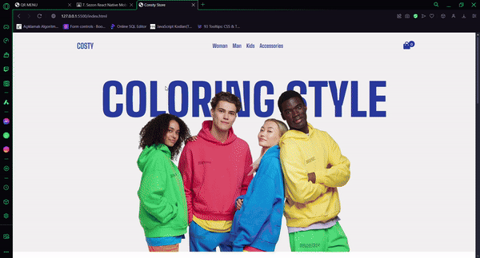

# Costy-Store👕👗

Costy-Store is an e-commerce clothing store developed using HTML, CSS, and JavaScript. This project aims to provide a simple, yet functional user interface for browsing and purchasing clothes online.

# Features🧶🛒

- **Responsive Design**: Fully responsive layout for desktop and mobile devices.
- **Product Listing**: Display of clothing items with descriptions, prices, and images.
- **Cart Functionality**: Add/remove items to the shopping cart and view the total price.
- **Interactive UI**: Smooth navigation and interactive elements using JavaScript.

# Preview🏟

